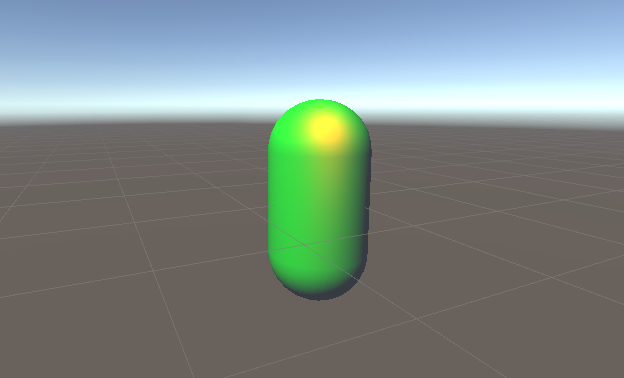
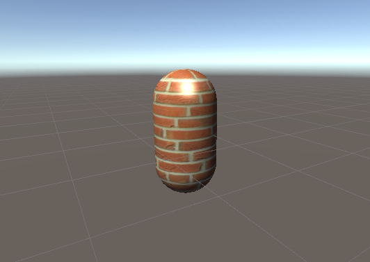
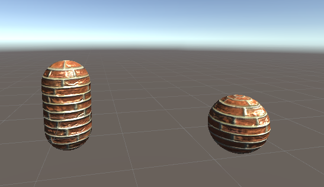
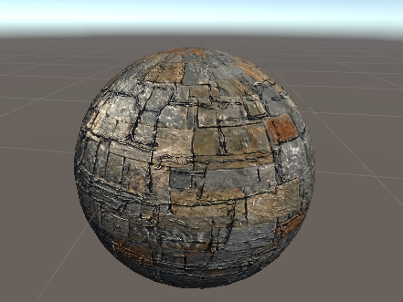
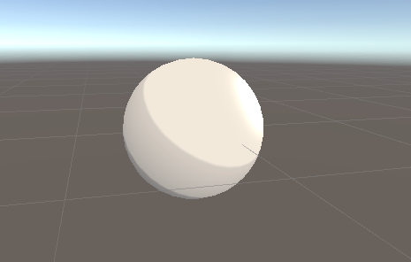
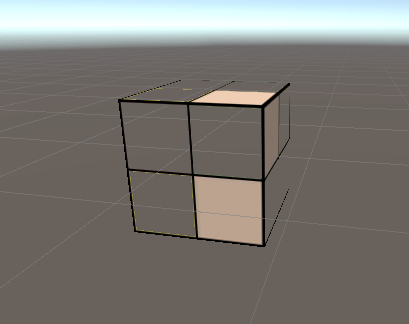
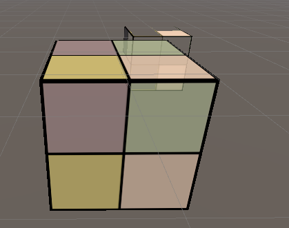
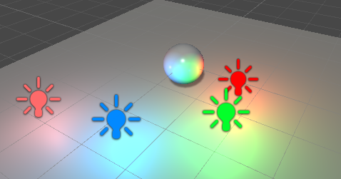
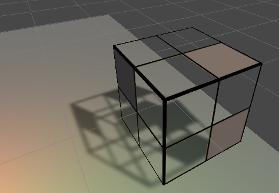

# MyUnityShaderLeaning
乐乐的Shader入门精要学习-Shader代码

## Chapter05 开始Unity Shader 学习

### 最简单的顶点/片元着色器

## 光照模型

Blinn-Phong模型

## 纹理基础

单章纹理

凹凸纹理

SpecularMask

渐变纹理

## 透明效果

透明度测试

混合

## 渲染路径

前向渲染

Shadow

